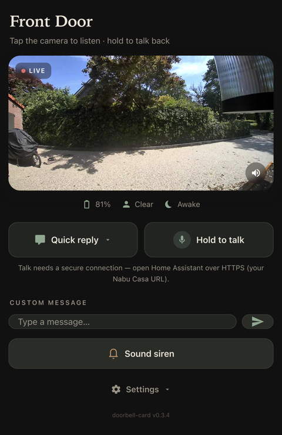
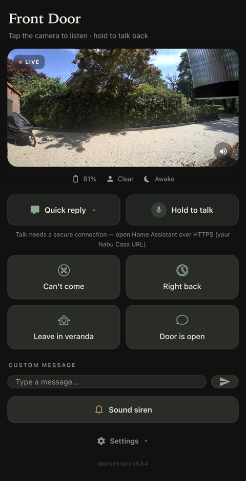
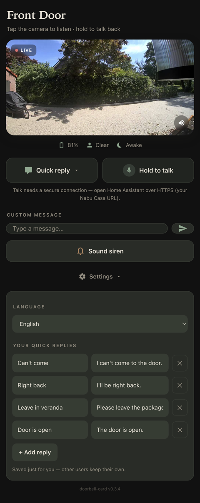
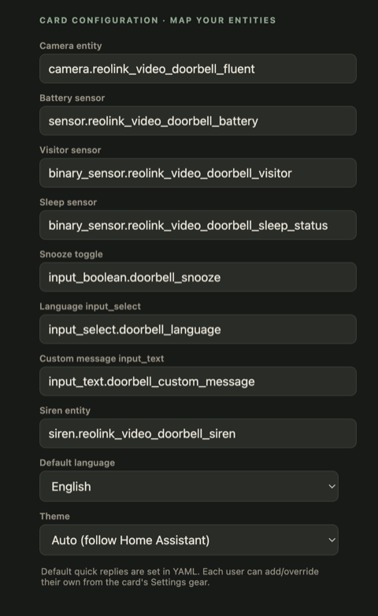
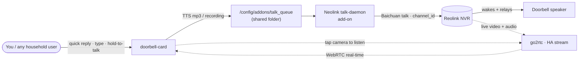

# Doorbell Card &middot; homeassistant-fe-doorbell

Turn a **Reolink video doorbell that lives behind a Reolink NVR/hub** into a full two‑way intercom on a Home Assistant dashboard. Home Assistant's `reolink` integration can *see* that doorbell but **cannot speak through it** — this repo fixes that with a single self‑contained Lovelace card: **listen** to the visitor, **talk** back, fire **multilingual quick replies**, or **speak any typed message** — all played out at the door.

[](https://my.home-assistant.io/redirect/hacs_repository/?owner=ds2000&repository=homeassistant-fe-doorbell&category=plugin)
[](https://www.buymeacoffee.com/daveshaw301)

| Front door | Quick replies | Per‑user settings | Entity mapper |
|:---:|:---:|:---:|:---:|
|  |  |  |  |
| Live camera (tap to listen), status, talk | One‑tap replies, expandable | Each user edits **their own** replies + language | Map your entities in the UI |

---

## Why this is hard (and what it solves)

Reolink cameras behind an NVR don't expose RTSP/ONVIF two‑way audio — they speak only Reolink's proprietary **Baichuan** control protocol. That's why Home Assistant's `reolink` integration can read battery, visitor and sleep state but can **not** do doorbell *talk*.

The fix is **[Neolink](https://github.com/QuantumEntangledAndy/neolink)**, an open‑source Baichuan bridge — but a bug stopped it working with battery doorbells. The Reolink Video Doorbell advertises **two** `<audioStreamMode>` values in its `TalkAbility` response, and stock Neolink's parser rejected the duplicate field and reported *"camera does not support talk."* This project bundles a **patched Neolink** that accepts multiple `audioStreamMode` entries (submitted upstream as **[QuantumEntangledAndy/neolink#415](https://github.com/QuantumEntangledAndy/neolink/pull/415)**, fixing issue #371).

Talk is relayed **through the NVR channel** over control‑plane Baichuan, and the NVR wakes the sleeping battery doorbell so audio actually reaches the speaker. **Listening** uses the camera's live stream over **WebRTC** (go2rtc) for real‑time, low‑latency audio.

---

## Features

- **One self‑contained card** — `custom:doorbell-card`. Shadow DOM, zero runtime dependencies, no external fonts.
- **Listen** — tap the camera for a real‑time **WebRTC** live view *with sound* (one speaker‑tap to enable audio on iOS, which blocks autoplay sound).
- **Hold‑to‑talk** — records your voice and plays it at the door.
- **Quick replies** — one‑tap phrases, spoken via Home Assistant Cloud TTS in the selected language.
- **Custom message** — type anything and have it spoken at the door.
- **Per‑user Settings gear** — every household member (no admin rights) can add/edit/remove **their own** replies and pick **their own** language; saved per‑user.
- **Live‑by‑default** — auto‑shows the live view when someone's at the door, and the snapshot when nobody's there (kind to the battery doorbell).
- **Multilingual** — English, Dutch, German, French, Spanish out of the box.
- **Visual editor** — map your entities, default language and theme from the dashboard UI (no YAML).
- **Theme‑aware** — follows Home Assistant's light/dark automatically.

---

## How it works



**Talk** (solid path): the card writes a Cloud‑TTS clip or your recording into a shared queue folder; the add‑on's daemon plays it to the doorbell with `neolink talk` over Baichuan, through the NVR channel.
**Listen** (dotted path): the doorbell's live video + audio is delivered to the card over WebRTC for real‑time monitoring.

> The talk backchannel is **exclusive** — while the add‑on is talking, the Reolink app can't talk through that camera at the same moment.

---

## Components

Everything ships in this repo:

| Component | Path | Role |
|---|---|---|
| **Card** | `doorbell-card.js`, `dist/`, `src/` | The `custom:doorbell-card` Lovelace element + visual editor. |
| **HA package** | `homeassistant/packages/doorbell_talk.yaml` | Helpers, three `shell_command`s, and the quick‑reply scripts. |
| **Add‑on** | `addon/` | The Neolink talk daemon. Multi‑stage Dockerfile builds the patched Neolink; `run.sh` watches the queue and plays audio. |
| **Cloud TTS** | `addon/tts_say.py` → `/config/tts_say.py` | Speaks the custom message in the selected language via HA Cloud TTS. |
| **Phrases** | `homeassistant/phrases.json` + `scripts/generate-phrases.sh` | Optional pre‑baked WAVs per language (the card uses live Cloud TTS by default). |

**Gotcha worth knowing:** HA `shell_command` templates only support simple `{{ var }}` substitution. The language → folder lookup is done in the **script's** `data:`, never inline in the command — a `` inside a `shell_command` raises `UndefinedError`.

---

## Configuration

Add the card to a **Panel / single‑card view**. Every option is optional; the defaults below match a Reolink Video Doorbell behind an NVR with the package installed. Entity names, default language and theme can also be set from the card's **visual editor** (no YAML — see the "Entity mapper" screenshot above), and each user customises their own replies/language from the in‑card **Settings gear**.

```yaml
type: custom:doorbell-card
camera: camera.reolink_video_doorbell_fluent
battery: sensor.reolink_video_doorbell_battery
visitor: binary_sensor.reolink_video_doorbell_visitor
sleep: binary_sensor.reolink_video_doorbell_sleep_status
person: binary_sensor.reolink_video_doorbell_person   # used for "live-by-default"
snooze: input_boolean.doorbell_snooze
language: input_select.doorbell_language
message: input_text.doorbell_custom_message
siren: siren.reolink_video_doorbell_siren
default_language: English   # spoken language (or set per-user from the gear)
auto_live: true             # auto-show live when visitor/person present
theme: auto                 # auto | light | dark
# Optional shared defaults. Each user can override these from the Settings gear.
replies:
  - name: Be right there        # button label
    phrases:                    # spoken text, per language
      en: "I'll be right there."
      nl: "Ik kom er zo aan."
  - name: Door is open
    phrases:
      en: "The door is open."
```

| Option | Default | Notes |
|---|---|---|
| `camera` | `camera.reolink_video_doorbell_fluent` | Snapshot + tap‑to‑listen WebRTC stream. |
| `battery` / `visitor` / `sleep` | reolink doorbell entities | Status row. |
| `person` | `binary_sensor.reolink_video_doorbell_person` | Triggers live‑by‑default. |
| `snooze` | `input_boolean.doorbell_snooze` | Optional snooze toggle (status chip). |
| `language` / `message` | `input_select` / `input_text` | TTS language + custom‑message field. |
| `siren` | `siren.reolink_video_doorbell_siren` | The dedicated Siren button. |
| `default_language` | `English` | Active spoken language (per‑user gear overrides). |
| `auto_live` | `true` | Live when someone's there, snapshot otherwise. |
| `theme` | `auto` | `auto` follows HA dark mode; pin with `light` / `dark`. |
| `replies` | built‑ins | Shared defaults; each user edits their own in the gear. |

**Reply options:** `name` (button label) + optional `icon` (mdi SVG path), then **either** `phrases` (language‑code → spoken text) **or** `service` (`domain.service` with optional `target`).

---

## Install (summary)

**Prerequisites:** Home Assistant OS / Supervised (for add‑ons), the **Reolink integration** configured, **Home Assistant Cloud (Nabu Casa)** for TTS, **HACS** for the card, a Reolink NVR/hub with the doorbell on a known channel, and SSH access to the HA host.

1. **Card** — install via HACS (badge above), or add `/local/doorbell-card.js` as a JavaScript‑module dashboard resource.
2. **Package** — copy `homeassistant/packages/doorbell_talk.yaml` to `<config>/packages/`, enable packages, and **restart HA**.
3. **Add‑on** — add this repo as an add‑on repository (or build locally) and create `<config>/addons/neolink.toml` from `addon/neolink.toml.example` (NVR `IP:mediaPort`, `channel_id`, credentials).
4. **TTS bridge** — drop `tts_say.py` at `/config/tts_say.py` and a long‑lived token at `/config/.ha_token` (`chmod 600`).
5. **Dashboard** — create a Panel view with one `custom:doorbell-card`.
6. *(Optional)* run `scripts/generate-phrases.sh` for pre‑baked phrase WAVs.

> **Microphone needs HTTPS.** Browsers (and the HA app's webview) only allow the mic over a secure origin — open Home Assistant via your **Nabu Casa** URL for hold‑to‑talk.

Full step‑by‑step instructions: **[docs/INSTALL.md](docs/INSTALL.md)**.

---

## Credits

- **[Neolink](https://github.com/QuantumEntangledAndy/neolink)** by QuantumEntangledAndy — the open‑source Baichuan bridge that makes any of this possible.
- The bundled TalkAbility fix for dual‑`audioStreamMode` battery doorbells, submitted upstream as **[neolink#415](https://github.com/QuantumEntangledAndy/neolink/pull/415)** (resolving issue #371).
- Sibling project to **[homeassistant-fe-tesla](https://github.com/ds2000/homeassistant-fe-tesla)** — same conventions: a self‑contained card, HACS plugin, zero runtime dependencies.

Built by **David Shaw** ([ds2000](https://github.com/ds2000)). If it saved you an afternoon, [buy me a coffee ☕](https://www.buymeacoffee.com/daveshaw301).

## License

[MIT](LICENSE) © David Shaw.
